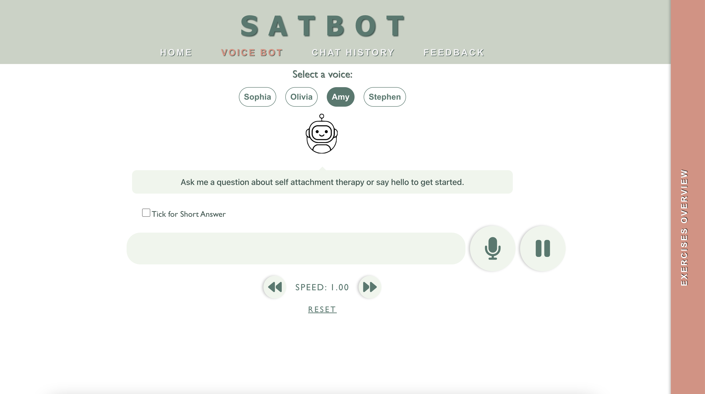

# A Voice-based Virtual Teacher for SAT

This project is a voice-based virtual teacher to teach self-attachment technique (SAT), an algorithmic and self-administrable intervention aimed at treating individuals with mental health issues.The virtual teacher guides users through an online SAT course, which encompasses 26 self-administrable exercises. Users engage with the virtual teacher through interactive voice exchanges, where they speak to the teacher
and receive responses in speech format.

To get started navigate to the voice bot page and click the microphone button once to start recording and once again to finish recording and send the question to the voice teacher.
## Main Folders
1) `./satbot-app`
This folder contains the frontend react app. In the project directory, you can run:
`npm run start`

This will run the frontend in [http://localhost:3000](http://localhost:3000) in your browser.

2) `./server`
To run the backend run  `python3 main.py` which will start up the flask server

Code for speech synthesis is in the file `speech_synthesis.py` where users need to set up [authentication credentials](https://boto3.amazonaws.com/v1/documentation/api/latest/guide/quickstart.html) for your AWS account using either the IAM Console or the AWS CLI.

There is a file called `demo.py` which tests the text-to-speech and speech-to-text models from hugging face in the report, fine-tuned whisper model link is [here](https://huggingface.co/ivy-tam/finetuned-whisper-base)

There is a subfolder called `./dataset`, this is where the main `SATCorpus` is and the `questions_dataset_final` is a list of similar questions to the dataset used for evaluation of the sentence transformer

The subfolder `model-scripts` contain code used to train the sentence transformer model and whisper model during implementation of the project

The subfolder `./fine-tuned-sentence-transfomer` contains the fine tuned sentenece transformer model.